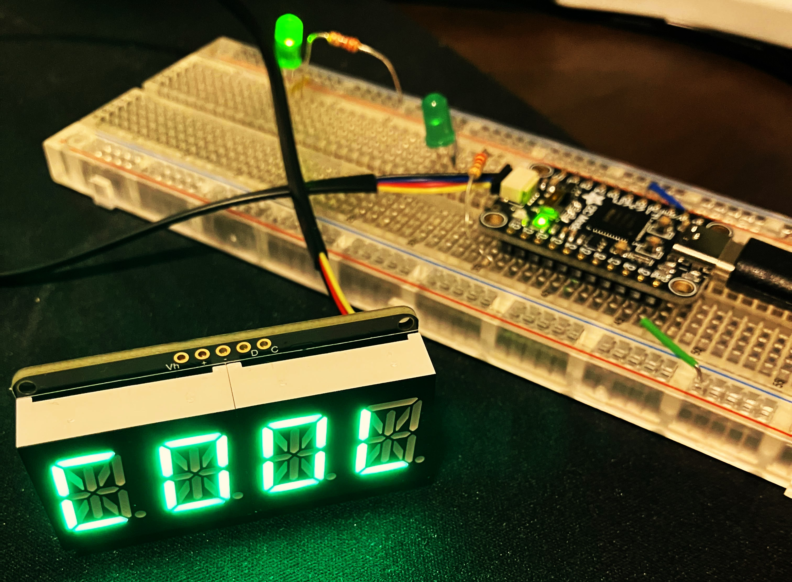
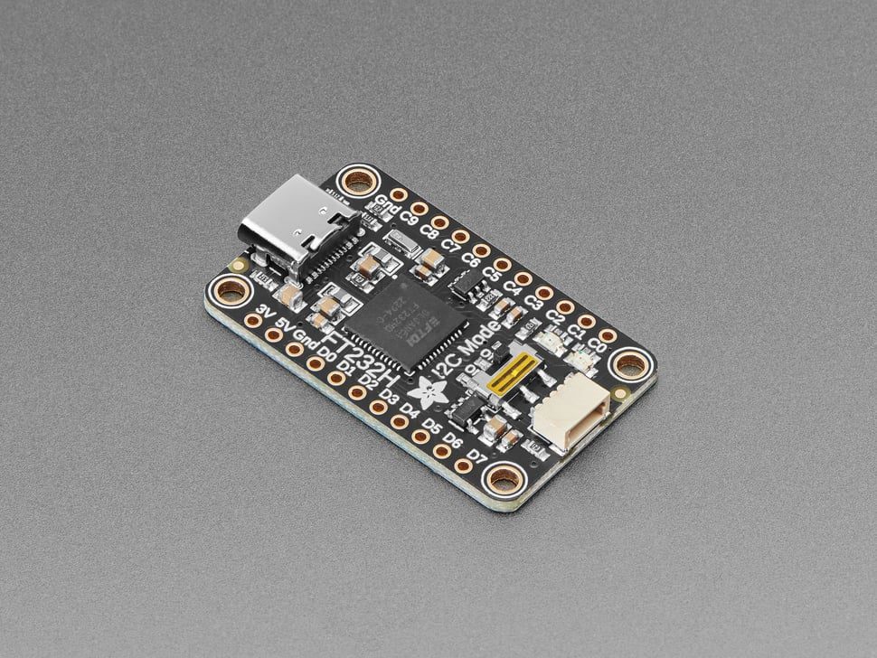
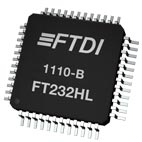
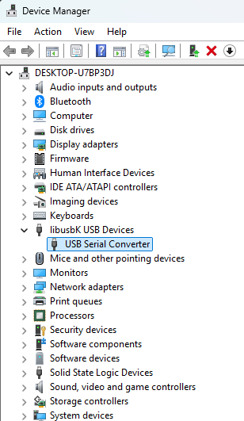
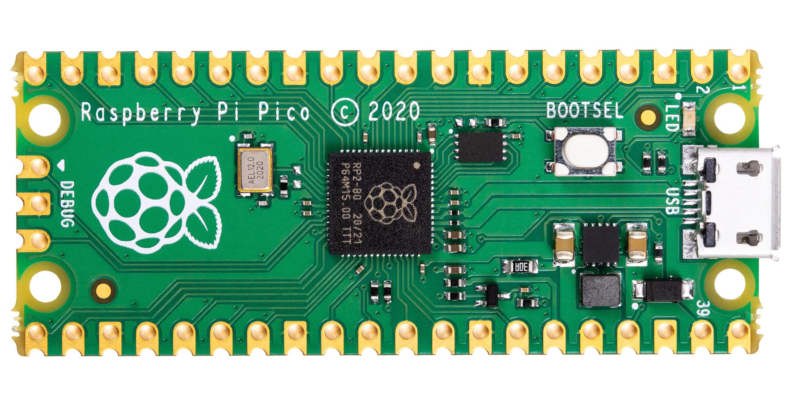
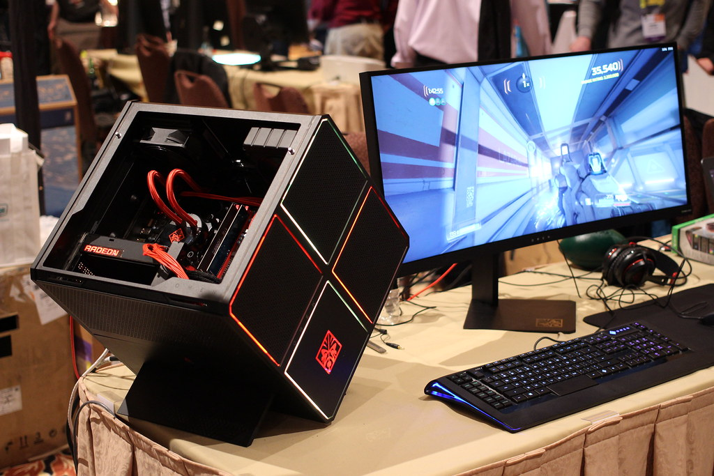
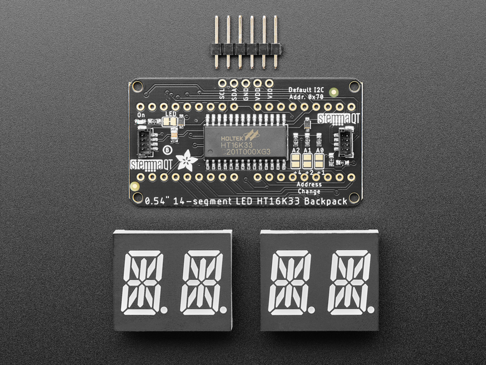
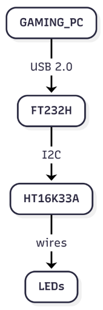

# My Demo

So I wanted to dig in and demystify hardware a little bit with a simple demo. 

**`COOL`**



Adafruit makes a [breakout board](https://www.adafruit.com/product/2264) for the [FTDI FT232H](https://www.ftdichip.com/old2020/Products/ICs/FT232H.htm).



The FT232H normally functions as a USB-to-serial converter, and by default, shows up as a Virtual Com Port when you connect to a computer over USB.



Adafruit explains in their [tutorial](https://learn.adafruit.com/circuitpython-on-any-computer-with-ft232h/windows) how to use the `libusbK` driver with it instead of the default FTDI drivers.
That means the device will show up as a libusbK device instead.



Ok but what are we actually trying to do here?

When you program a microcontroller, you need to flash the microcontroller and then run the code.
There are many popular ways to do this.
Rasberry Pi, Adruino, ESP32, STM32, etc.


If you want to upload a new program, then you have to reset the microcontroller to run the bootloader, and go through the programming again.
This is often done with a physical button on the MCU, but some boards can have remote ways of resetting too.

Anyway, the point is that normally the program would be running on an MCU that you program.



But, I want to run the program on my Windows gaming PC instead.



What's cool about this FT232H set up it is possible, and easy! You can run python code on your computer, and still communicate directly with hardware peripherals over standard protocols, like [I2C](https://en.wikipedia.org/wiki/I2C).

It's explained in more detail in [this tutorial](https://learn.adafruit.com/circuitpython-on-any-computer-with-ft232h/running-circuitpython-code-without-circuitpython).

I went through the setup, and got the python libraries installed.

```powershell
PS C:\Users\Matt\Projects\ft232h> python -m pip list | findstr /i "pyusb pyftdi adafruit"       
Adafruit-bitfield                        1.5.1
Adafruit-Blinka                          9.0.2
adafruit-circuitpython-busdevice         5.2.15
adafruit-circuitpython-connectionmanager 3.1.6
adafruit-circuitpython-pixelbuf          2.0.10
adafruit-circuitpython-requests          4.1.15
adafruit-circuitpython-seesaw            1.18.0
adafruit-circuitpython-typing            1.12.3
Adafruit_GPIO                            1.0.3
Adafruit-PlatformDetect                  3.88.0
Adafruit-PureIO                          1.1.11
pyftdi                                   0.57.1
pyusb                                    1.3.1
```

So now I can run this to dump the info about my USB device:

```
import usb
dev = usb.core.find(idVendor=0x0403, idProduct=0x6014)
print(dev)
```

and this:

```
import board

print(f"board_key: {board.board_key}")
```

Will print out `board_key: FTDI_FT232H`. Amazing!

Then you can dump what pins are available, along with whatever other python fields are there too.

```
import board

print(dir(board))
```

which will output:

```
['C0', 'C1', 'C2', 'C3', 'C4', 'C5', 'C6', 'C7', 'D4', 'D5', 'D6', 'D7', 'I2C', 'MISO', 'MOSI', 'SCK', 'SCL', 'SCLK', 'SDA', 'SPI', '__blinka__', '__builtins__', '__cached__', '__doc__', '__file__', '__loader__', '__name__', '__package__', '__repo__', '__spec__', '__version__', 'ap_board', 'board_id', 'board_imports', 'board_key', 'board_module', 'detector', 'f', 'get_import_file', 'import_mod', 'json', 'pin', 'sys']
```

Blinking an LED is pretty straightforward using [digitalio](https://docs.circuitpython.org/en/latest/shared-bindings/digitalio/). 
In real life, connect an LED and resistor to the C0 pin, and then you can reference it from the code using `board.C0`.

```
import digitalio

led = digitalio.DigitalInOut(board.C0)
led.direction = digitalio.Direction.OUTPUT

while 1:
    led.value = False
    time.sleep(0.1)
    led.value = True
    time.sleep(0.1)
```

So now that the LED is blinking, I wanted to try actually writing a driver to interface with the quad digit display that I also [bought from Adafruit](https://www.adafruit.com/product/2160).



This display backpack uses the [HT16K33A](https://www.holtek.com/page/vg/HT16K33A) RAM Mapping 16×8 LED Controller Driver with keyscan.

> The HT16K33A is compatible with most microcontrollers and communicates via a two-line bidirectional I2C bus.

So with everything connected, it would basically look like this:



And then we can read through the [HT16K33A datasheet](https://www.holtek.com/page/vg/HT16K33A) to understand how to work with the driver.

The basic idea is that we can write bytes over I2C to the driver, and the driver will read the bytes and control the LEDs.

We can do that with python code like this:

```python
    address = 0x70
    i2c.writeto(address, bytes([0x21]))
```

If you made it this far, go ahead and read through the code in [./run.py](./run.py) to see how it works. I documented the HT16K33A commands in the comments in python, to explain why we are writing the byte values and what they mean. `board` is just using [busio](https://docs.circuitpython.org/en/latest/shared-bindings/busio/) to read/write over I2C.

If you want inspiration for a future project, go ahead and pick any I2C device you find. Connect to the FT232H and see if you can get something running. Your PC now has an easy ability to control hardware peripherals. Happy coding!